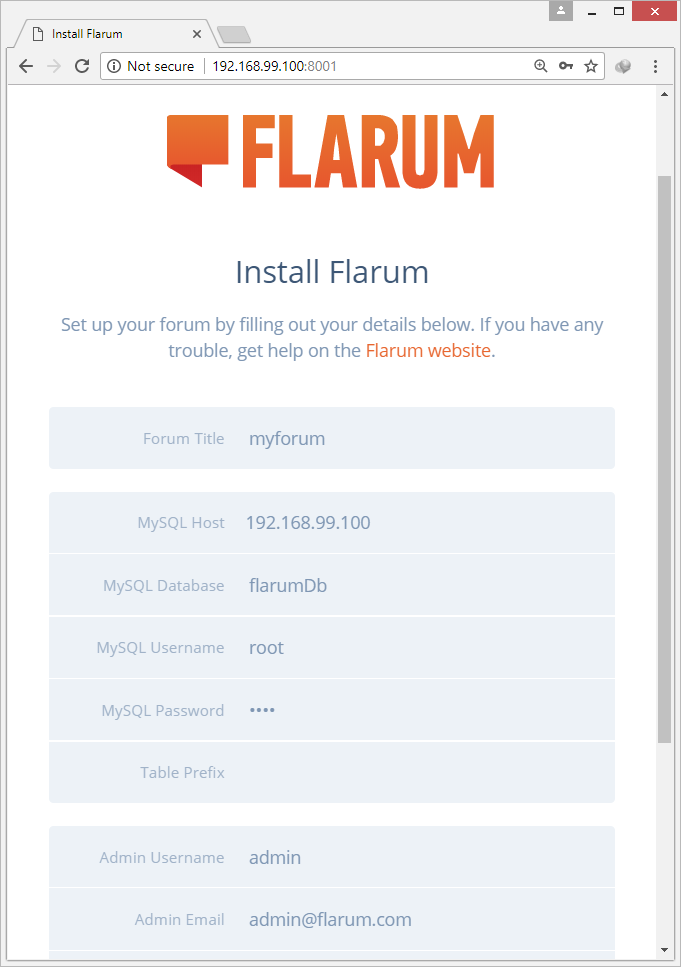

# Dockerized flarum

A docker version of flarum using LAMP (Linux, Apache, MySQL, and PHP).

Original flarum repo is right here:

  https://github.com/flarum/flarum

### What's the difference between this and docker-flarum ?

  docker-flarum: https://github.com/mondediefr/docker-flarum

  Simply, this one allows you to **develop flarum** actively with no pain ! You can modify the folder `www/html` directly.

  Aside from the fact that docker-flarum is production-ready.

### Downloading Docker

  Choose the correct version of Docker for your machine from here:
    https://store.docker.com/search?type=edition&offering=community

### How to run this ?

It's really simple, clone the repo and run this command:
  ```
  docker-compose up
  ```

To know which ip address it's running on:

  ```
  docker-machine ip
  ```

You will find it listening on port `8001`, in my case:

  http://192.168.99.100:8001

  

### Database

  To install flarum, you will need to know the setup of the database.

  `docker-compose.yml` contains all the info about the database:

  | Key       | Value                                   |
  | ----------|:---------------------------------------:|
  | Host      | machine ip address (ex: 192.168.99.100) |
  | Database  | flarumDb                                |
  | User      | **root**                                |
  | Password  | **test**                                |

### Troubleshooting

  #### `"<volume>" includes invalid characters for a local volume name`
  This is because you're running **docker tools on Windows**.
   
  You need to make docker-compose convert Windows paths, by running this command:
  ```
  $Env:COMPOSE_CONVERT_WINDOWS_PATHS=1
  ```
  
  #### `Cannot create container for service dockerapp`
    
  * **docker-tools**:
    If you're using docker-tools on Windows, cloning the repo into your desktop will do.

  * **DockerCE**:
    You would need to allow sharing drives in docker

    